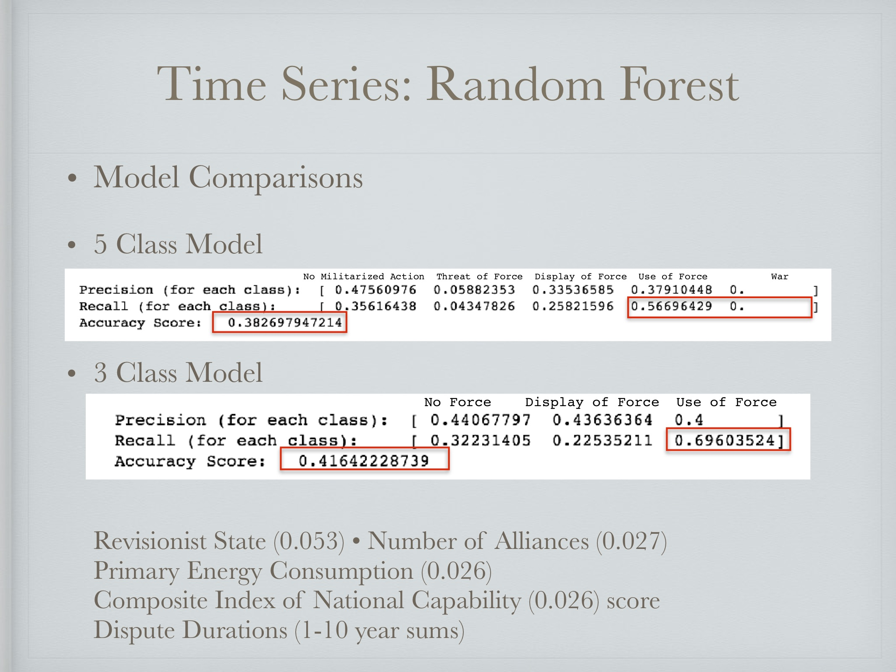

Hostility between nations is terrifying. The Correlates of War dataset allows for investigation into some of the predicting features that can indicate when war may erupt. This project aimed to look at time series data to predict when hostility will happen.  

 

