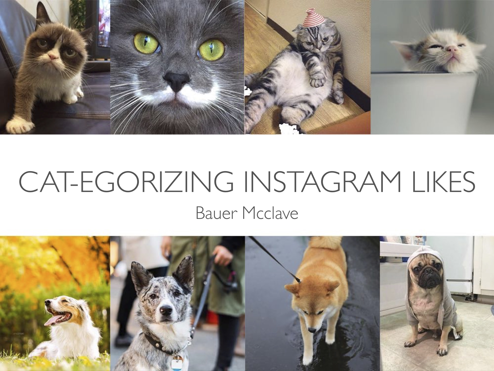
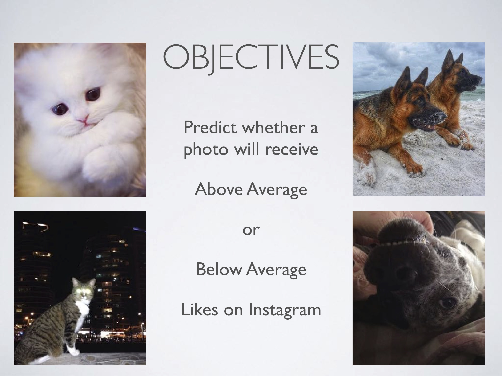
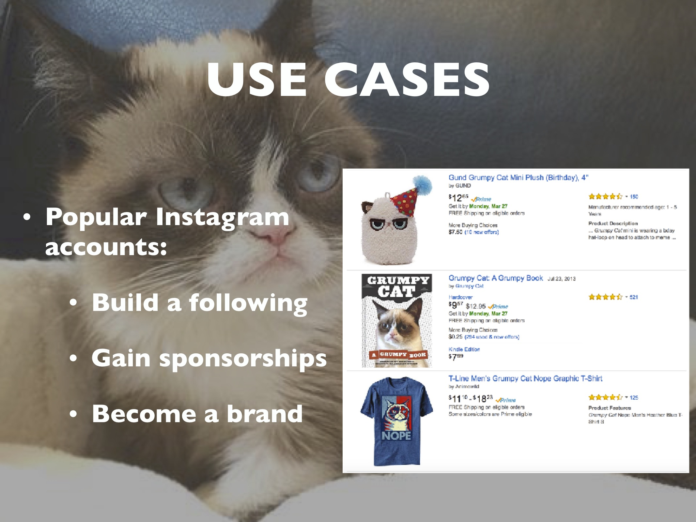

Determining what makes a desirable, or likeable picture is still outside of neural networks wheelhouse. This is a presentation I gave on my work to see what neural nets can achieve. I specifically paired down to two types of photos, cats and dogs, and worked with a convolutional neural netowrk to get the follwoing results.  
   
 
   

  

